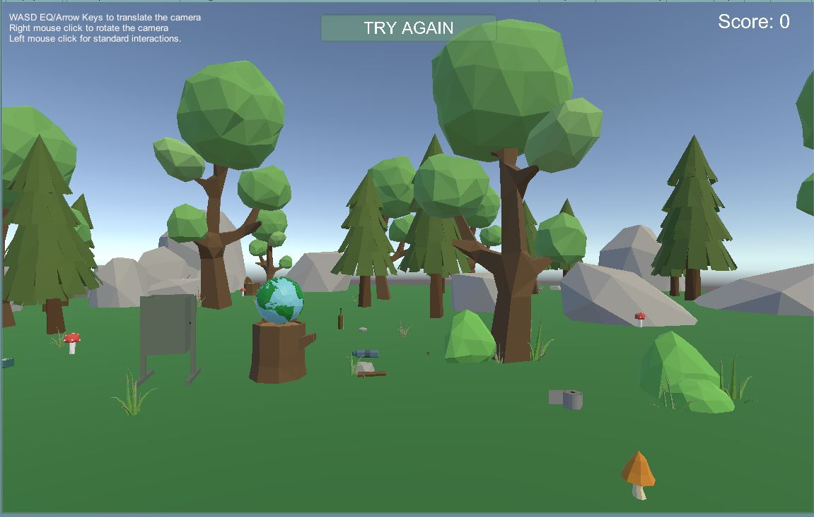

# VRProject-kkoenig

### Project description: 
This little 3D VR (using SteamVR) project demonstrates a environment puzzle game. 
The VR user has to grab the trash and put it into a trashcan, but he mustn't put the natural elements into it, otherwise the score will go down.
 
### Development platform: 
Windows 10, 
Unity 2019.1.14f1, 
Visual Studio Community 2019 version 16.3.10, 
SteamVR Plugin 2.5.0 (sdk 1.8.19), 
Scripting Runtime Version: .NET 4.x Equivalent

### Target platform: 
Oculus Rift S/Rift/Vive

### Necessary setup/execution steps: 
You need Unity, SteamVR Plugin (imported and installed), a Rift/Vive/Rift S.
Clone the project, run the project. 

### Screenshot  

### Third party material: 
- Stylized Earth by In Your Face
- Low-Poly Simple Nature Pack by JustCreate
- Trash Low Poly Cartoon Pack by BlankfaceStanislav

### Project state: 
90 %

### Limitations: 
None

### Lessons Learned: 

Copyright by Kathrin19
